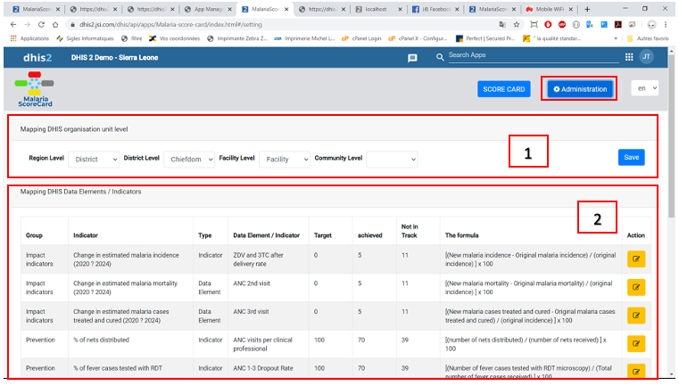
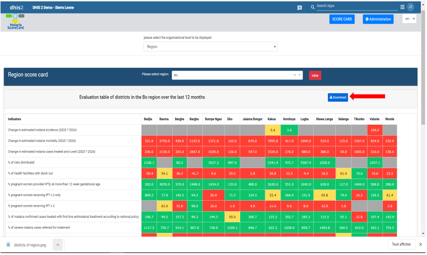

[Accueil](./index.md) | [Apropos](./about.md) | [Specifications](./specs.md) | [Guides](./userguide.md)

# Guide d'installation de l'application Malaria Scorecard
L'application Malaria dashboard est installable sur une instance de DHIS2. Pour en savoir plus visitez le site de DHIS2 [ici](https://docs.dhis2.org/fr/use/user-guides/dhis-core-version-238/maintaining-the-system/installing-applications.html)

# Démarrer avec l'application Malaria Scorecard

## 1. Présentation de l'application

Malaria scorecard est une application qui permet l'analyse des données du paludisme aux niveaux décentralisé de la pyramide sanitaire. Les indicateurs sont d'abord paramétrées  dans la menu administration, puis elle sont présentées sous forme de tableau au format carte de score.

## 1. Lancer l'application

Dans le menu de dhis2, cliquez sue le logo de l'application scorecard pour ouvrir l'app.

## 1. Présentation de la page d'accueil de l'apps

Une fois l'application ouverte, une page daccuiel vide avec deux (2) boutons s'affiche:

- Le premier bouton (**SCORE CARD**) est le bouton permettant d'afficher les fiches d'évaluation en fonction des niveaux d'unités d'organisations.

- Le second bouton (**ADMINISTRATION**), permet d'avoir accès à la page de paramétrage de l'application.

NB : Avant d'afficher les tableaux il faut s'assurer que les indicateurs ont été paramétrés dans la page administration.

## 1. Administration

Dans la page administration, nous avons deux (2) zones :

1- La zone du mapping des unités d'organisations

2- La zone de mapping des éléments de données et des indicateurs

### 1. Mapping des unités d'organisation

Les niveaux d'unités d'organisations diffèrent d'un pays à l'autre. Certains pays en ont jusqu'à 4, 5, 6, etc. Pour ce faire, vous devez paramétrer les niveaux d'organisations correspondant au deecoupage de la pyramide sanitaire de votre pays.

Après avoir choisir les niveaux de la pyramide sanitaire, cliquez sur le bouton **save** pour sauvegarder votre paramétrage.

### 1.  Mapping des éléments de données et indicateurs

Dans la zone de mapping des éléments et indicateurs, vous verrez la liste des indicateurs, le groupe et la formule pour obtenir les valeurs en pourcentage. Ses données se trouve dans le data store de l'application.

Il faudra donc mapper ses indicateurs aux indicateurs et éléments de dhis2. Et aussi paramétrer les valeurs qui doivent représentées les bonnes données.

Pour paramétrer une ligne, vous devez cliquer sur le bouton **Edit** en jaune juste à l'extrême droite.

Une fois le bouton **edit** actionner, vous verrez les champs à paramétrer s'activer pour vous permettre d'apporter votre modification.

Le premier champ est le type. Vous devez choisir le type (**indicateur** ou **élément de données**) dans lequel se trouve votre indicateur.

Après voir choisi le type, vous pouvez sélectionner votre indicateur ou élément de données.

Une fois finis les étapes de sélection de type et éléments de données, vous devez paramétrer les **couleurs**.

Pour paramétrer les couleurs vous avez 3 champs de sélection :

1- Le champs **Target (la cible)** qui a deux valeurs **0** et **100**.

Par exemple, si vous voulez que vos valeurs qui devront avoir la couleur **verte**  soit compris entre 0 et 20, vous sélectionnez dans le **target** **0** et dans **Achieved** **20**.

Et si dans le cas vous voulez avoir la couleur verte entre 100 et 70, vous sélectionnez dans le **target** **100** et dans **Achieved** **70**.

2- Le champs **Achieved**, est la limite de notre target sélectionner.

3- Le champ Not in track est la partie ou les valeurs prennent la couleur **rouge**

**NB** : entre la valeur achieved et not in track les valeurs on la couleur **Jaune**. Et lorsqu'il n'y a pas de        valeur alors c'est la couleur **grise**.

Une fois les paramétrages terminer, vous cliquez sur le bouton **save** en vert à l'extrême droite.

**Scorecard**

Le paramétrage étant finir, vous pouvez maintenant afficher votre fiche d'évaluation en fonction des niveau d'unités d'organisation.

Sur cette page, nous avons une seule zone de sélection. Dans cette zone de sélection, vous pouvez choisir le niveau que vous voulez afficher (région, district, facility).

Une fois le niveau choisir, vous verrez afficher une autre zone de sélection qui vous permettra de sélectionner la région, le district ou le centre communautaire dont vous désirez afficher sa fiche d'évaluation.

Après avoir choisir le nom, vous cliquez sur **view** pour l'affichage.

**NB** : la période d'affichage est fixée au 12 derniers mois.

Lorsque vous cliquez sur view, vous verrez deux (2) tableaux s'afficher.

1- Tableaux des sous niveaux du niveau choisir des 12 derniers mois

2- Tableaux general du niveau choisir des 12 derniers mois.

Dans notre exemple ici, nous avons afficher la fiche d'évaluation de la région de BO des 12 derniers mois

Fiche d'évaluation des districts de la région de Bo des 12 derniers Mois

Fiche d'évaluation des 12 derniers mois de la région de BO

**Télécharger les tableaux**

Pour sauvegarder vos tableaux dans le but d'une analyse avec votre équipe, vous pouvez télécharger les tableaux en cliquant sur le bouton **download**

Image de la carte de score de la région de Bo

* * *

[Accueil](./index.md) | [Apropos](./about.md) | [Specifications](./specs.md) | [Guides](./userguide.md)