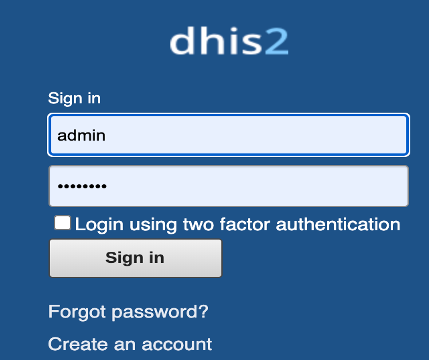
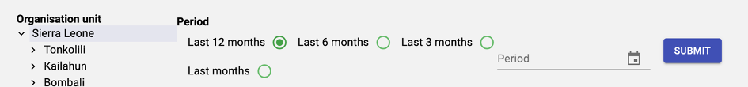

[Accueil](./index.md) | [Apropos](./about.md) | [Specifications](./specs.md) | [Guides](./userguide.md)

# Guide d'installation de l'application Malaria Dashboard
L'application Malaria dashboard est installable sur une instance de DHIS2. Pour en savoir plus visitez le site de DHIS2 [ici](https://docs.dhis2.org/fr/use/user-guides/dhis-core-version-238/maintaining-the-system/installing-applications.html)

# Démarrer avec l'application Malaria Dashboard

## 1.	Accès à Malaria Dashboard

Malaria Dashboard est une apps DHIS2 disponible dans le menu principal de DHIS2. On y accède a partir du menu principal de DHIS2 web c’est-à-dire accessible via un navigateur (google chrome, fire fox mozilla, opera, etc.)
Pour démarrer MALARIA-DASHBOARD, il faut accéder à son instant DHIS2   en renseignant l’URL dans la barre d’adresse du navigateur (Google Chrome,Firefox ect .), ensuite renseigner les informations de connexion comme suit :

Une fois dans l’interface de DHIS2 on y accède en cliquer dans le menu principal sur l’icône de l’application

## 2.	Présentation de l’interface de MALARIA-DASHBOARD
La barre de menu principale présente deux modules : ADMINISTRATION et DASHBOARD

### 2.1 Le menu ADMINISTRATION 
Ce menu nous offre la fonctionnalité qui permet de mapper les indicateurs de notre instance DHIS2 aux indicateurs de référence.
Pour ce faire nous allons cliquer sur le lien ADMINISTRATION. La liste des indicateurs de référence regroupée en groupe d’indicateur apparait comme suit :

Pour mapper les indicateurs DHIS2 aux indicateurs de référence nous devons suivre les étapes suivantes :
#### * Étape 1 :  Cliquer sur le Lien « edit » dans la colonne « Action » du tableau

#### * Étape 2 : Sélectionner le type de l’indicateur et renseigner le groupe, l’indicateur le formulaire de saisie et éventuellement la désagrégation

#### * Étape 3 : Cliquer sur le bouton « SUBMIT ». Le mapping est effectué et la ligne du tableau est mise à jour avec les informations de l’indicateur DHIS2.

#### * 2.1 Le menu DASHBOARD 
Ce menu nous permet de générer les graphiques en fonction des paramètres choisis.
Pour ce faire nous allons cliquer sur le lien « DASHBOARD » du menu principal. Nous accédons ainsi à l’interface de sélection des paramètres.

La génération du Dashboard se fait selon les étapes suivantes :

#### * Étape 1 : Sur l’interface de paramétrage, Sélectionner l’unité d’organisation et la période. Puis cliquer sur le bouton « SUBMIT »

#### * Étape 2 : Les graphiques du Dashboard sont générés automatiquement et classés en fonction des groupes d’indicateurs.

#### * Étape 3 : Les graphiques peuvent être exportés aux formats images, pdf et excel. Pour ce faire cliquer sur le menu dans le coin droit du graphique et sélectionner le type de l’exportation comme suit : 

* * *

[Accueil](./index.md) | [Apropos](./about.md) | [Specifications](./specs.md) | [Guides](./userguide.md)