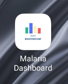
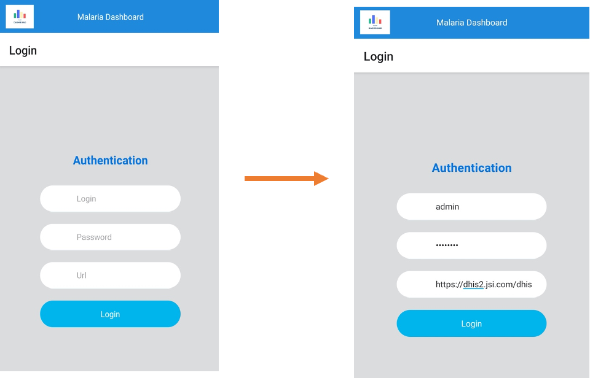
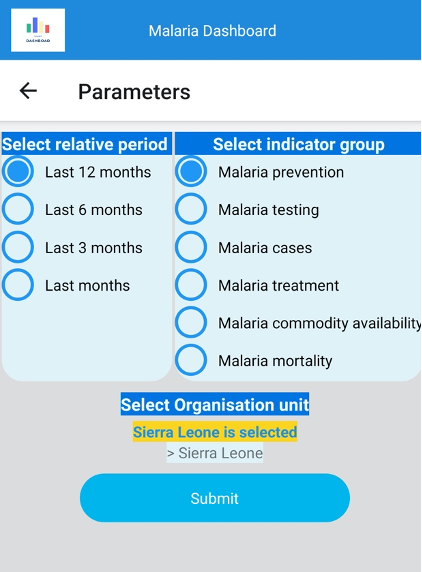
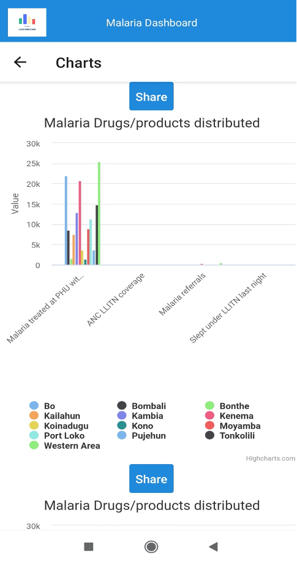
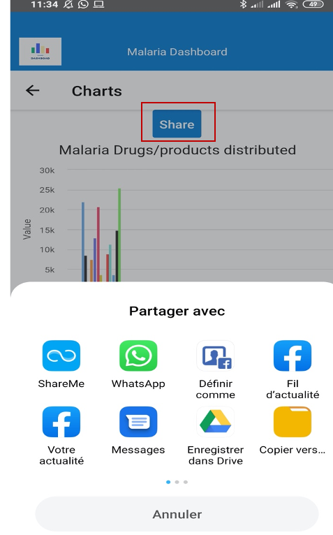
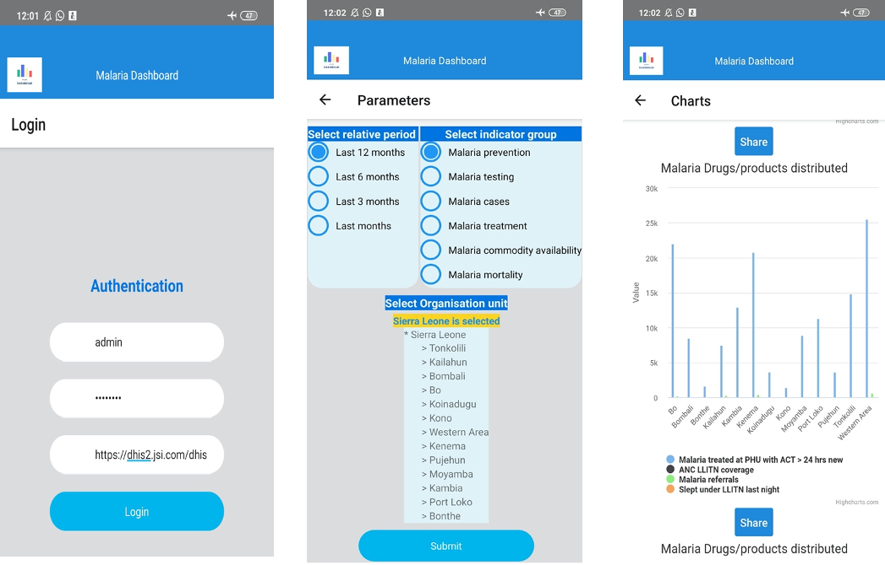
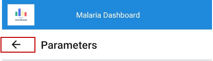

[Accueil](./index.md) | [Apropos](./about.md) | [Specifications](./specs.md) | [Guides](./userguide.md)

* * *

# PREMIER PAS AVEC MALARIA-DASHBOARD-MOBILE-APPS

MALARIA-DASHBOARD-MOBILE-APPS est une application mobile qui permet d’accéder à un tableau de bord en fonction des paramètres sélectionnés.
Il fonctionne en mode online et offline .
Une foi installée, Il se présente comme suit :

## I.	Online mode
### 1.	Connexion à MALARIA-DASHBOARD
Entrer les paramètres de connexion nom d’utilisateur, mot de passe et url de connexion

### 2.	Sélection des paramètres
Sélectionner les paramètres de génération du tableau de bord : la période relative – le groupe d’indicateur et l’unité d’organisation

### 3.	Tableau de bord
Cette interface présente le tableau de bord généré en fonction des paramètres sélectionnés précédemment

### 4.	Sharing
Pour partager un graphique sur les réseaux sociaux cliquer sur le bouton « share »

## II.	Offline

Le mode offline nous permet d’accéder aux informations précédemment générées en mode online. Lorsqu’en mode online nous avons accéder à la plateforme et généré un tableau de bord en fonction des paramètres sélectionnés, ces informations sont enregistrées localement et donc disponible en mode offline. 
Le mode offline suit les étapes 1,2 et 3 définies précédemment :

Etape 1                            			Etape 2					Etape 3

**Remarque :**
La flèche comme indiquer sur la figure en dessous, permet un retour en arrière sur la page précédente

* * *

[Accueil](./index.md) | [Apropos](./about.md) | [Specifications](./specs.md) | [Guides](./userguide.md)