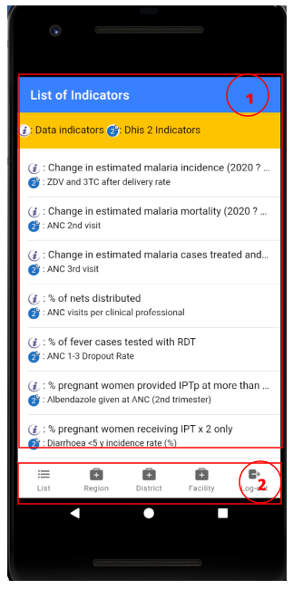
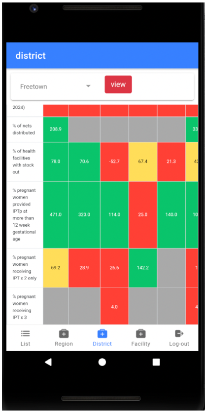

[Accueil](./index.md) | [Apropos](./about.md) | [Specifications](./specs.md) | [Guides](./userguide.md)

* * *

# **Démarrer avec l’application mobile Malaria Scorecard**

## **1. Connexion**

Pour se connecter à l’apps mobile vous devez renseigner 3 champs obligatoires :

- L’Url de votre instance DHIS
- Votre Non Utilisateur (user Name) de votre instance DHIS
- Et votre Mot de passe de votre instance DHIS

Une fois ces informations renseigner, cliquez sur **Login** pour vous connecter.

## **2. Page d’accueil**

En cas d'authentification réussie, vous accédez accès à la page d’accueil.
La page d’accueil est divisée en deux (2) zones.

1. La liste des indicateurs mappés sur dhis2:

Dans cette partie nous avons la légende en jaune qui indique les indicateurs du data store avec l’icône *i* et les indicateurs de dhis2 mappés avec l’icône *2*.

1. La zone des menus

## **3. Niveau Région**

Cliquez sur l’onglet Région en bas de page. Vous verrez la page région s’afficher.

Vous devez ensuite sélectionner une région dans la zone de recherche puis vous cliquez sur le bouton rouge view pour visualiser deux tableaux.

- Le tableau des districts de la région sélectionnée des 12 derniers mois
- Le tableau des 12 derniers mois de la région sélectionnée

Après avoir cliqué sur le bouton view, vous verrez les cartes de scores des différents districts de la région sélectionnée.

Carte de score des districts de la région de western Area

Carte de scores des districts de la région de Bombali

 

Carte de scores de la région de Bombali des 12 derniers mois

## **4. page district**

Le procéder est le même que pour la région.

1. Sélectionne le district

1. Cliquez sur view.

Carte des scores des etablissements du district freetown.

## **5. page facility**

Le procéder est le même que pour la région.

1. Sélectionne le facility

1. Clique sur view

Score card des centres communautaires 

Cartes de scores des 12 derniers mois du centre agape CHP

## **6. Partager le score card**

Pour partager votre tableau vous devez cliquer le bouton share.

Une fois cliqué, le bouton se déroule pour faire place aux choix des applications de réseaux sociaux disponibles.

Vous pouvez ensuite sélectionner le réseau social avec le quelle vous voulez partager la carte de score.

Exemple de partage sur tweeter

## **7. Mode Offline**

Le mode offline vous permet d'afficher les données même en l'absence de connectivité Internet. Ce mode s’active automatiquement dès la perte de l'accès d’internet.

Le mode Offline vous permet:

- De vous connecter avec vos identifiants de connexion
- De visualiser tous les tableaux score card que vous avez ouvert en Online

Apercu du mode hors linge de la région de Western Area

Lorsque la connection internet est rétablie, l’application passe en mode Online automatiquement.

## **8. Déconnection**

Pour se déconnecter vous cliquer sur l’onglet log-out juste en bas à droite de l’application.

* * *

[Accueil](./index.md) | [Apropos](./about.md) | [Specifications](./specs.md) | [Guides](./userguide.md)