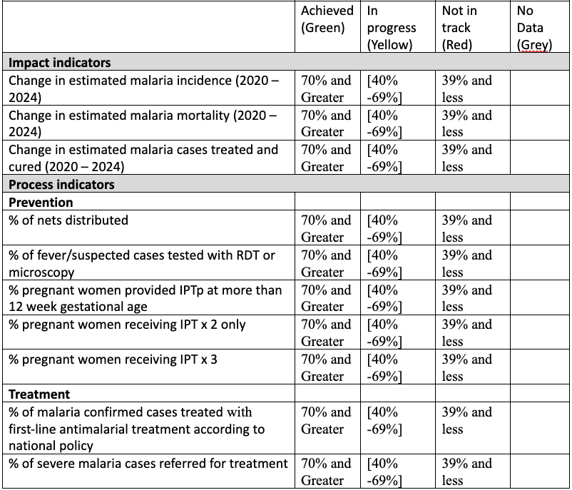
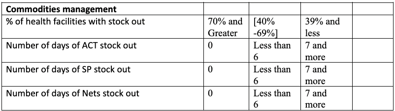
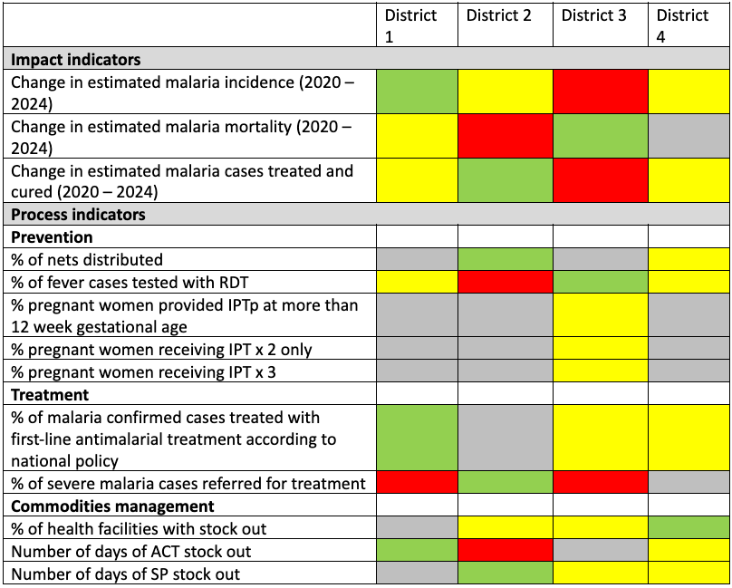
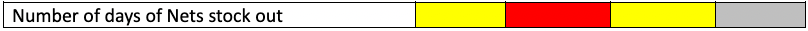
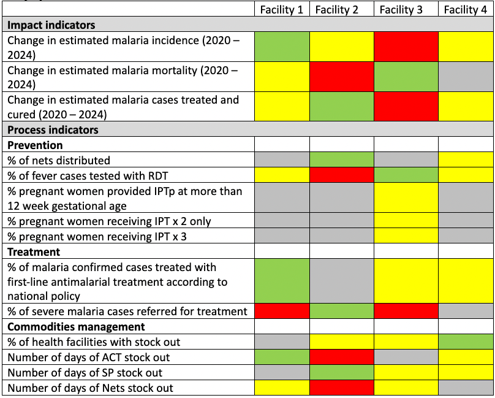
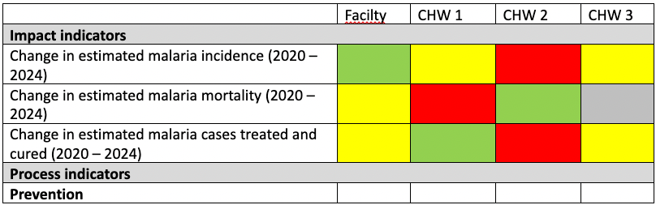
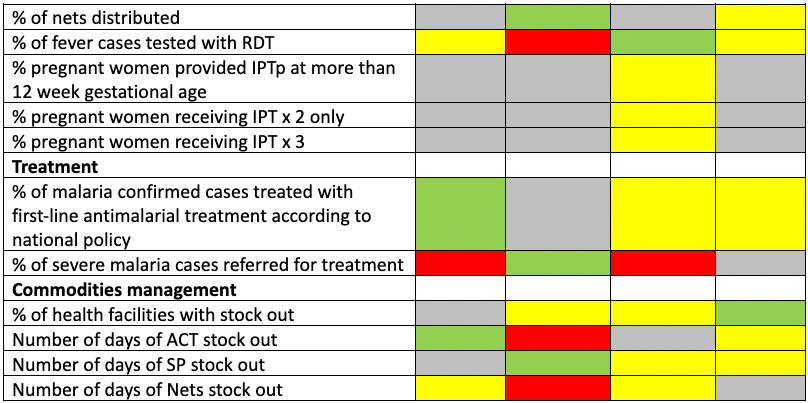
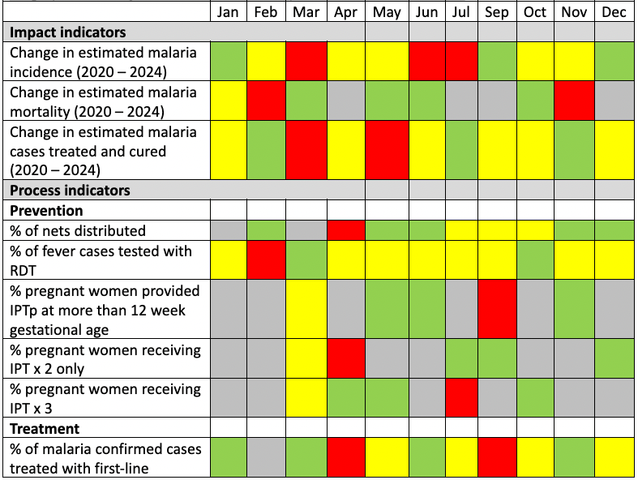
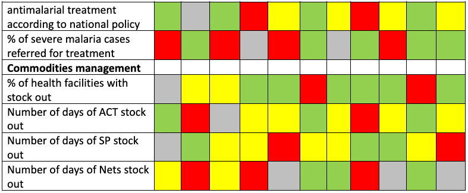

[Accueil](./index.md) | [Apropos](./about.md) | Specifications | [Guides](./userguide.md)

# MEASURE MALARIA SCORECARD APP

## FUNCTIONAL AND TECHNICAL REQUIREMENTS

### 1.  Functional Requirements for a set of Malaria M&E scorecards for mobile devices
        ==============================================================================

#### Users

MEASURE Evaluation envisions a diverse set of potential users at the periphery of the health system, including:

District level:

-   Malaria program managers

-   Data managers (malaria program, and HMIS)

-   Supply chain managers (pharmaceutical and malaria commodities, such as bed nets)

-   District health medical officers

-   Vector control personnel

-   Disease surveillance officers

Facility level:

-   Facility In-charge 

-   Data manager (Hospital) 

-   Malaria focal person (hospital) 

-   Health service provider (Health center)

-   Stock managers

Community level:

-   Community Health Workers

-   Village volunteers

Content: 

The mobile dashboards should have up-to-date information for program indicator

-   Impact indicator performance score comparisons between districts and between health facilities

-   Process indicator performance score comparisons between districts and between type of health facilities over time

-   Facility process performance score comparisons between services(Prevention, treatment, commodities, health outcomes and mortality) over time

-   Maps of facility coverage performance score comparisons 

Functionality

-   See performance score in different colors in a table or map in a given period

-   See a scorecard performance for the health outcome indicators (cured, deaths) over time for one region or district or facility

-   Select content to be displayed in the scorecard as needed, from a list of indicators, data elements or rates. 

-   select how an indicator is displayed -- i.e. as a scorecard table 

-   display thematic maps (if possible)

-   Have multiple "views" -- i.e. toggle between different configured scorecards (2-3 tables each), for different aspects of program monitoring (e.g. treatment, prevention, commodities, health outcome, etc.)

-   make a static report (like a PDF) of a given scorecard that could be readily shared (email or posted to social networking platform)  - PDF export functionality

-   ability to add text-based annotations (e.g. for interpretations) of individual tables

-   compare results with predefined performance scores -- Apply a color legend based on predefined targets for each indicator or data element.

-   Show GPS coordinates (e.g. distribution of health centers or CHWs engaged in malaria activities

Key performance indicators and Intervals

The proposed score performance targets are illustrative. Each country will define their score performance targets to monitor.

Display of the Region scorecard table

Display of the District scorecard table

 Display of the Facility scorecard table
 
 

 Display of one Region or District or Facility scorecard table over time

1.  Technical requirements for the MEASURE Malaria scorecard app
    ============================================================

1.  ### Phase 1: DHIS2 web based responsive mobile friendly scorecard app

The first phase of the project will consist of developing a REACT.js DHIS mobile friendly app that will allow mobile display of the scorecards representation of a set of indicators.

### Configuration interface:

-   Will allow the selection of a DHIS2 indicator and data element group to be used for scorecard generation.

-   Ordering of the scorecards

### Scorecard mobile interface

-   Display of mobile friendly scorecard automatically adjusting to the screen dimensions (Mobile or Desktop)

### Report module

-   Possibility to download the scorecards in PDF or image format.

1.  ### Phase 2: Android scorecard view app 

During this initial phase an android app will be developed that will only download the scorecard generated using the web based DHIS2 mobile friendly app in a PDF or Image format and display it on the mobile phone offline.

1.  ### Phase 3: Android fully configurable dynamic offline scorecard app

During this phase, the app will evolve to allow download of the metadata and a certain amount of data related to a selected set of indicators for a certain number of periods to the mobile device and allow for use in a predefined set of scorecard tables designed to be used on a mobile phone app.

1.  ### Programming language:

During phases 1 the DHIS2 mobile friendly app will be developed using JavaScript programming language and the following libraries:

-   REACT.js for the app development

-   Bootstrap for the template engine

-   Highchart library for dashboard charts generation

At the phase 2 and 3 the Android app will be developed using the JAVA programming language.

* * *

 [Accueil](./index.md) | [Apropos](./about.md) | Specifications | [Guides](./userguide.md)
